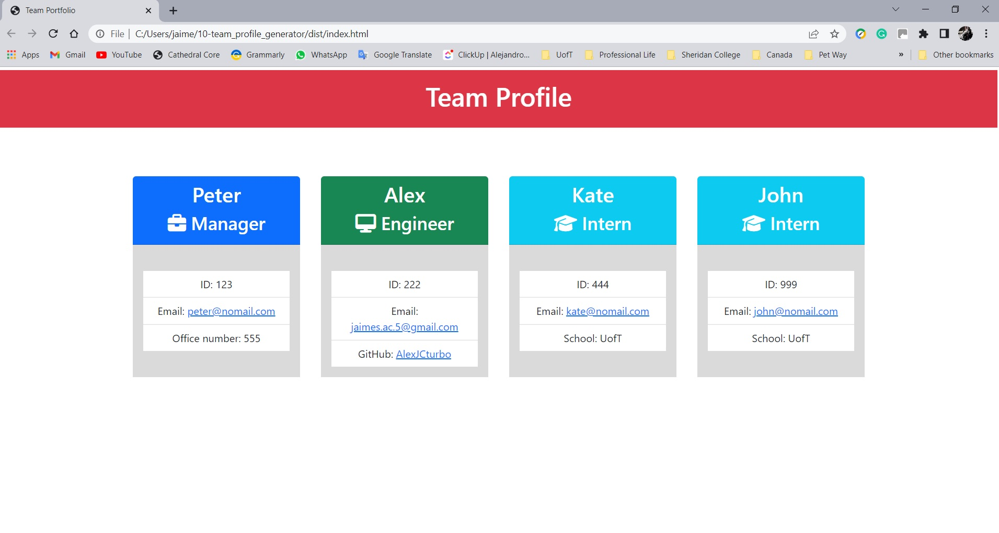

# Team Profile Generator

## Table of Contents
- [Project Description](#Project-Description)

- [Installation](#Installation)

- [Usage](#Usage)

- [Test Instructions](#Test-Instructions)

- [Questions](#Questions)

- [Links](#Links)

- [References](#References)

- [License](#License)

- [Walkthrough Video](#Walkthrough-Video)

## Project Description
This project is a Node.js command-line application that takes in information about employees and generates an HTML webpage that displays summaries for each team member.

The project consists of a series of constructors and one super constructor that provide the framework of the application. These constructors were tested using Jest to ensure their functionality.

When running the app, the user is prompted with a series of questions to collect the data of each team member. The npm inquirer was utilized for this purpose.

After collecting all the team members' data, the program generates the HTML and CSS files that contain cards with each team member's information.

The following image is a sample profile team created with this application:

###### [Back to Index](#Table-of-Contents)

## Installation
To run the team profile generator, the user must install Node.js, the npm inquirer application and Jest. Download Node.js from the [Node.js website](https://nodejs.org/en/) and install it. Also, using the command line install the [npm inquirer](https://www.npmjs.com/package/inquirer), and [Jest](https://jestjs.io/docs/getting-started) following the instructions from their websites. Once they are installed, in the terminal, run the app by typing “node index.js” from the develop directory of the project.
###### [Back to Index](#Table-of-Contents)
	

## Usage
To run this program, the user has to initialize the app in the command line from the terminal in the main directory of the project by entering the command “node index.js”. This command executes the program and the user is prompted with a series of questions from the team members. With the data of the employees, the app will generate the HTML and CSS files within the dist directory.
###### [Back to Index](#Table-of-Contents)

## Test Instructions
Install the dependencies on your computer: Node.js, Jest and npm inquirer. Add a .gitignore file and include node_modules/ and .DS_Store/. To test the constructors using Jest, in the command line type "npm run test" to verify that they are working correctly. Then, execute the app from the terminal by typing “node index.js” from the directory where it is located. The program must then run.
###### [Back to Index](#Table-of-Contents)
	

## Questions
Please, fee free to get in touch with me at jaimes.ac.5@gmail.com to discuss any inquiries or suggestions for the project. I will be happy to connect with you!
###### [Back to Index](#Table-of-Contents)
	

## Links
[Application Repository](https://github.com/AlexJCturbo/team_profile_generator)

[GitHub Profile](https://github.com/AlexJCturbo)
###### [Back to Index](#Table-of-Contents)

## References
- [Node.js](https://nodejs.org/en/)
- [npm inquirer](https://www.npmjs.com/package/inquirer)
- [Jest](https://jestjs.io/docs/getting-started)
###### [Back to Index](#Table-of-Contents)
	

## License
ISC
Copyright 2022 by Alejandro Jaimes
	
Permission to use, copy, modify, and/or distribute this software for any purpose with or without fee is hereby granted, provided that the above copyright notice and this permission notice appear in all copies.

THE SOFTWARE IS PROVIDED "AS IS" AND THE AUTHOR DISCLAIMS ALL WARRANTIES WITH REGARD TO THIS SOFTWARE INCLUDING ALL IMPLIED WARRANTIES OF MERCHANTABILITY AND FITNESS. IN NO EVENT SHALL THE AUTHOR BE LIABLE FOR ANY SPECIAL, DIRECT, INDIRECT, OR CONSEQUENTIAL DAMAGES OR ANY DAMAGES WHATSOEVER RESULTING FROM LOSS OF USE, DATA OR PROFITS, WHETHER IN AN ACTION OF CONTRACT, NEGLIGENCE OR OTHER TORTIOUS ACTION, ARISING OUT OF OR IN CONNECTION WITH THE USE OR PERFORMANCE OF THIS SOFTWARE.
###### [Back to Index](#Table-of-Contents)

## Walkthrough Video
The following [walkthrough video](https://drive.google.com/file/d/1xsPNB_mdybmnOsZV8lGk9hyhJXhKo4tn/view?usp=sharing) demonstrates the functionality of the Team Profile Generator.
###### [Back to Index](#Table-of-Contents)